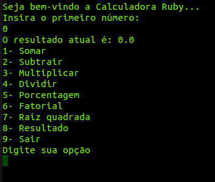

# Ruby Calculator

### A simple calculator developed with Ruby during Grupo Euax intern program bootcamp.

---

## Requeriments:

- Ruby

## Getting Started: 
- Open project folder in your terminal
- Run "ruby calculator.rb"
- Enjoy :)
  
---

